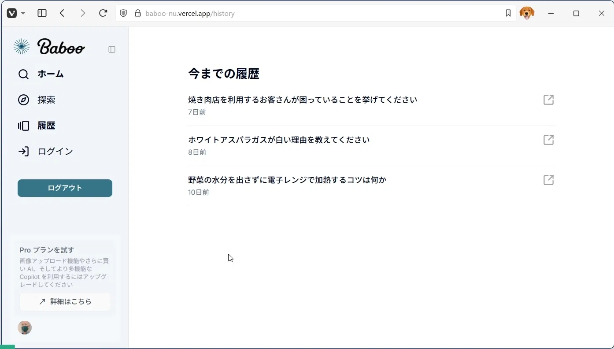
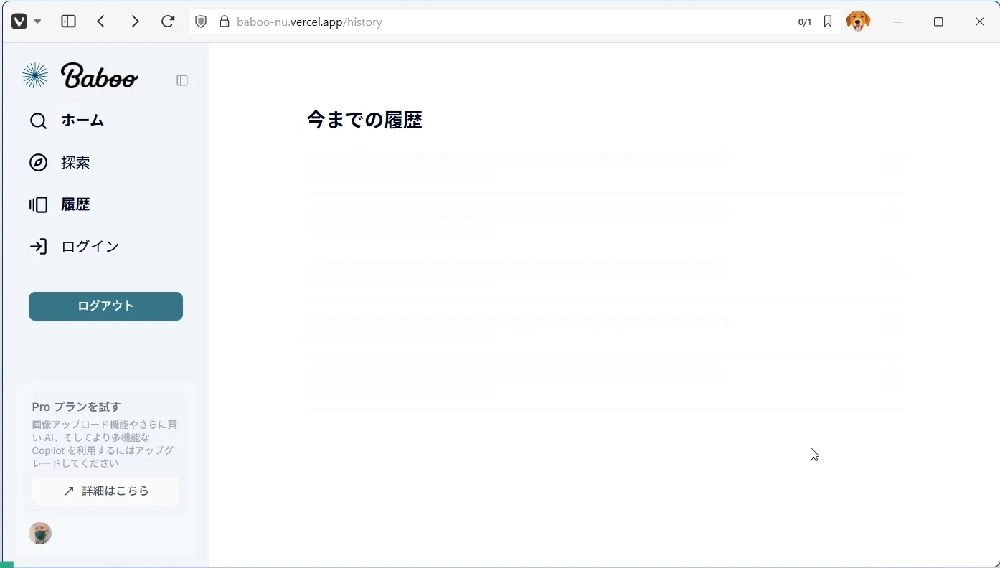

  

    
    
    
    
    
    
    
    
    
    
    
    
    
    
  

  <h3 align="center">CONVERSATIONAL AI SEARCH APP</h3>

  

    リアルタイム AI 検索回答アプリ
  

## 📋 <a name="table">もくじ</a>

1. 🤖 [はじめに](#intro)
2. 🔗 [URL](#url)
3. 😮‍💨 [Baboo の概要](#description)
4. 🔋 [AI 検索回答アプリの機能](#feature)
5. 🚀 [アプリの利用サンプル](#example)
6. 💻 [画面サンプル](#screen_sample)
7. 🤸 [終わりに](#outro)

## <a name="intro">🤖 はじめに</a>

AI との自然な会話を通じて、あなたの知りたい情報をすばやく見つけることができる会話型 AI 検索アプリ、**Baboo** をご紹介します。

## <a name="url">🔗 URL</a>

Baboo | CONVERSATIONAL AI SEARCH APP    
https://baboo-nu.vercel.app

---

## <a name="description">😮‍💨 Baboo の概要</a>

**Baboo（バブー）** は、AI を活用した対話型の検索エンジンアプリです。従来の検索エンジンとは異なり、自然言語での質問に対して AI が理解し、リアルタイムで最適な回答を提供します。
おもな特徴や機能は以下の通りです。

### おもな特徴

#### 🥳 対話型 AI 検索

ユーザーが自然な言葉で質問すると、AI が文脈を理解して最適な回答を生成します。
従来のキーワード検索ではなく、会話するような感覚で情報を取得できます。

#### 👯 最新の検索技術との連携

Brave Search API を利用することで、ウェブ上の最新かつ関連性の高い情報を取得し、AI がそれを要約・整理して提示します。これにより、情報の網羅性と正確性を両立しています。

#### 💾 過去の検索履歴を保存

あなたの検索履歴を保存し、いつでも見返すことができます。これにより、以前調べた内容を簡単に確認したり、会話を再開したりすることが可能です。

#### 🤹‍♀️ 想定される利用シーン

- 特定のトピックについて深く掘り下げて知りたいとき
- 複雑な情報をわかりやすく要約してほしいとき
- アイデア出しやブレインストーミングのパートナーとして
- 日々の疑問をすぐに解決したいとき

#### 🔨 技術的背景

Google Gemini を利用した高度なテキスト生成能力と、Brave Search API によるリアルタイムのウェブ検索機能を組み合わせています。これにより、AI が最新の情報を取得し、ユーザーの質問に対して質の高い回答を生成します。

フロントエンドと API は、Next.js を使った Web アプリ構成です。
タスク実行のクラウドジョブ管理には Inngest を使用しています。

- フロントエンド/バックエンド: Next.js, React, TypeScript
- UI: Tailwind CSS, shadcn/ui
- 認証: Clerk
- データベース: PostgreSQL, CockroachDB
- AI (LLM): Google Gemini
- 検索API: Brave Search API
- ジョブ管理: Inngest
- コード品質: ESLint, Prettier

#### まとめ

**Baboo（バブー）** は、AI との会話を通じて情報を検索できる、次世代の検索体験を提供する無料の Web サービスです。自然な言葉で質問するだけで、AI が最新のウェブ情報を基に的確な回答を生成し、あなたの疑問を素早く解決します。

---

## <a name="feature">🔋 会話型 AI 検索アプリの機能</a>

### 🏠 検索への入口

- ランディングページ

### ユーザ認証機能

- 🗝️ ログイン
- 🔐 ログアウト

### 📡 リアルタイム検索処理

- 検索ワードまたは疑問を自由入力
- Brave Search API を用いたソース収集
- 引用ソース付きの回答表示
- 関連情報の提示

### 🤖 AI 要約生成

- Gemini による要約と補足説明
- 非同期処理による応答最適化

### ライブラリ管理

- ユーザーごとの検索履歴保存
- AI とのやりとりをスレッド形式で管理

### 🌐 ニュース探索機能

- 最新のニュース記事やブログを取得
- トピック（IT / サイエンス / 教育など）の選択 UI

---

## <a name="example">🚀 アプリの利用サンプル</a>

##### 検索デモ
<!-- ./images/baboo_demo.mp4 -->
<video src="https://github.com/user-attachments/assets/4117b3bd-8628-4857-93fa-62c17fab7810" controls="true"></video>

---

## <a name="screen_sample">💻 画面サンプル</a>

### 検索への入口

#### ランディングページ 

### ユーザ認証機能

#### ログイン

#### ログアウト

### 対話型検索機能
#### 🚶 メイン検索画面

#### 🔍 質問入力

#### 🌐 検索結果表示

#### 🪶 AI 回答生成

#### 🎨 参考情報表示

#### 🧑‍🎨 会話履歴

### 履歴画面
#### 🧑 ログイン認証

#### 🧑‍🎨 会話履歴一覧表示

#### 🚋 過去の会話への移動

---

## <a name="outro">🤸 おわりに</a>

今回は、Google Gemini と Brave Search API を組み合わせることで、ユーザーがより自然に、そして効率的に情報にアクセスできる会話型 AI 検索アプリ Baboo を作成しました。

信頼性の高い情報を簡潔に得たいユーザー、トピックを深堀りしたい学習者や研究者、そして情報収集効率を高めたいすべての人におすすめのアプリです。

将来的には、マルチエージェント機能や音声検索など、よりインタラクティブな機能拡張も検討中です。
